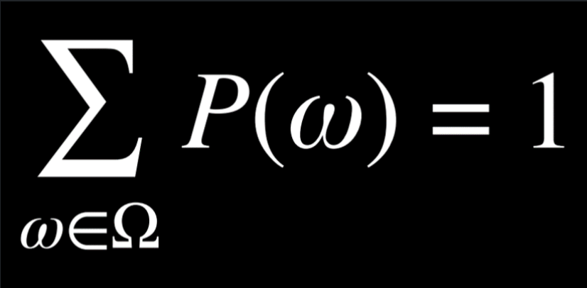
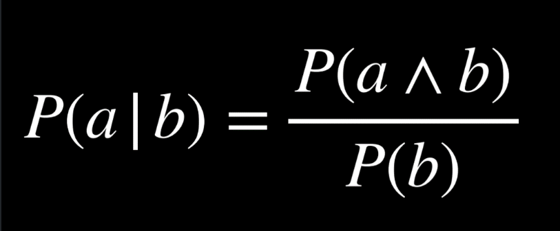
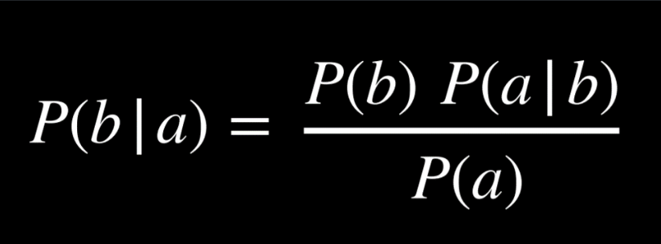
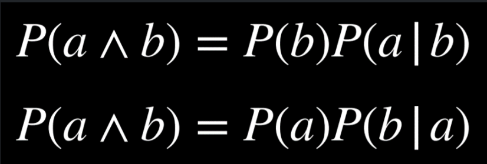
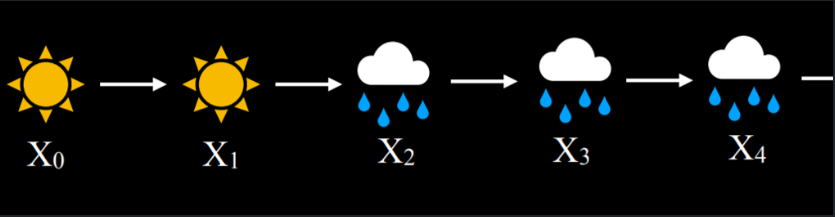
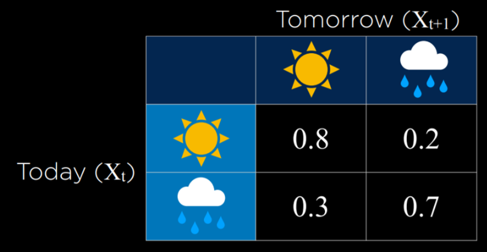
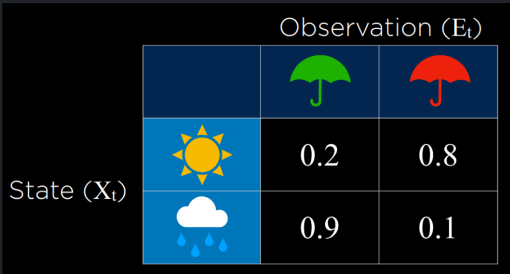
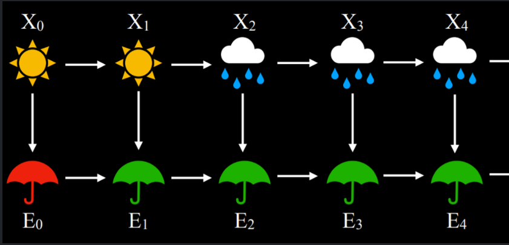

# Module 2: Uncertainty

## a. Probability

- Small omega denotes a possible event/outcome/world within a universe of all possible outcomes (big omega) which we may denote as such:



- Unconditional probability is “the degree of belief in a proposition in the absence of any other evidence” which is saying, when we have no evidence to say other events have influenced a given event, the probability calculated for it is UNCONDITIONAL

---

## b. Conditional probability

- Unconditional probability is “the degree of belief in a proposition given some evidence that has already been revealed” - saying we know that other events affect the probability of our given event and so the probability of that event is CONDITIONAL
- Conditional probability equations:



---

## c. Random variables

- Usually denotes an event that can have different outcomes (i.e. let X model the outcome of the roll of a fair dice: X can be integers 1 to 6 and each event has associated probability)
- PROBABILITY DISTRIBUTION: The associated probabilities to each event
- Can be expressed in vector notation with event and probability paired
- INDEPENDENCE: the knowledge that two events do not affect each other’s probabilities
- Mathematically expressed as P(a ∧ b) = P(a)P(b)

---

## d. Bayes Rule

- Used to compute conditional probabilities:



- NOTE this equation requires us to already know the reverse conditional probability to make the calculation but often times we will have one conditional probability that is easy to measure empirically but the reverse is not
  - I.e. We want to know P(D | +) where D is has disease, + is tested positive
  - We know that only 1% of the population actually have the disease
  - P(D) = 0.01
  - In our trials for the test we can easily measure:
  - P(+ | D) ~ from a population of patients ALL with the disease, how many +
  - P(+ | D’) ~ false positive rate from population WITHOUT the disease
  - And so with this info we can calculate P(D | +)
    - P(+ | D) P(D) = P(D | +) P(+) from Bayes Rule ~ let P(+) be x
    - P(+) = P(+ and D) + P(+ and D’) ~ can use venn diagram to reason this
- P(+ and D) = P(+ | D) P(D)
- P(+ and D’) = P(+ | D’) P(D’)

---

## e. Joint Probability

- Probability of event1 AND event2 happening is their JOINT probability
- Written as P(1 and 2) or P(1, 2) or P(1 ∧ 2)



- From the relation on the right, we can treat P(b) as a constant - k - and say
  - P(A|B) = 1/k P(A,B)
  - P(A’|B) = 1/k P(A’,B)
  - P(A|B) + P(A’|B) = 1/k (P(A,B) + P(A’,B))
  - We know P(A|B) + P(A’|B) = 1 as A can only either happen or not happen
  - And we know P(A,B) + P(A’,B) = P(B) ~ can reason from venn diagram
  - Hence 1 = 1/k P(B) which checks out as P(B) = k
- *NOTE, it is more common to let 1/P(B) = k
- This proportionality relation is IMPORTANT because it tells us GIVEN a particular event, what the RELATIVE probabilities of the next events are
  - I.e. P(cloud | rain) = k P(cloud ∧ rain)
  - Here, we know P(rain) and we let 1/P(rain) = k
  - We also know:
    - P(cloud ∧ rain) = 0.08
    - P(cloud ∧ rain’) = 0.02
    - This information allows us to write a probability distribution for the random variable C (whether there are clouds or not), given that rain is falling:
      - P(C | rain) = P(C, rain)/P(rain) = αP(C, rain) = α<0.08, 0.02>
      - Note here that α = 1/P(rain)
      - And that C is a RANDOM VARIABLE that can represent the events of either CLOUDS or NOT CLOUDS
      - “Rain” is NOT a random variable (hence why not represented by letter) as we are finding probability ASSUMING that rain is certain
      - P(C | rain) = α<0.08, 0.02> is not YET a probability distribution as probability of all mutually exclusive events in the universe must sum to 1
- Hence, α(0.08 + 0.02) = 1
- Hence, α = 10
- Hence, P(C | rain) = <0.8, 0.2>

---

## f. Probability Rules

- Negation: Events can either happen or not happen so P(A) + P(A’) = 1
- Inclusion-Exclusion: P(a ∨ b) = P(a) + P(b) - P(a ∧ b) ~ reason from venn
- Area enclosed by venn is P(a) + P(b) minus one of their overlaps
- Marginalization: P(a) = P(a, b) + P(a, ¬b) ~ Similar to what negation is saying but within event a
- Conditioning: P(a) = P(a | b)P(b) + P(a | ¬b)P(¬b) ~ Marginalization with Bayes’ Rule applied

---

## g. Bayesian Networks

- Data structure representing the dependency in a given random variable’s (conditional) probability on other random variables
- The random variables that DIRECTLY affect a given random variable are depicted as that random variable’s PARENTS
- And each random variable is represented by a node on the diagram
- INFERENCE:
  - Query (X) - the random variable we want to find prob dist for
  - Evidence Variables (E) - variables that we KNOW the state of
  - Hidden Variables (Y) - intermediate nodes between E and X
  - We want to find P(X | E) probability distribution
- INFERENCE BY ENUMERATION
  - First we create the nodes , containing their links to their parents (see course notes)

```python
from pomegranate import *

# Rain node has no parents
rain = Node(DiscreteDistribution({
    "none": 0.7,
    "light": 0.2,
    "heavy": 0.1
}), name="rain")
```

- Then, explicitly add the links between the nodes: we define a node’s parents when we create the node but these edges must also be defined to describe the graph structure

```python
# Create a Bayesian Network and add states
model = BayesianNetwork()
model.add_states(rain, maintenance, train,
appointment)

# Add edges connecting nodes
model.add_edge(rain, maintenance)
model.add_edge(rain, train)
model.add_edge(maintenance, train)
model.add_edge(train, appointment)

# Finalize model
model.bake()
```

- Then ask to calculate the probability of a given event - i.e. Given no rain, no maintenance, train on time what is the probability we attend the meeting

```python
probability = model.probability([["none", "no", "on time", "attend"]])
print(probability)
```

- Alternatively, can ask for probability distributions for each node in Bayesian Network
  - The first block calculates the predicted probability distributions for all random variables, give that the train is delayed: each distribution is stored in the same sequence as the nodes in the model, as items in the “predictions” list
  - The second block just prints them out

```python
# Calculate predictions based on the evidence that
the train was delayed
predictions = model.predict_proba({
    "train": "delayed"
})

# Print predictions for each node
for node, prediction in zip(model.states,
predictions):
    if isinstance(prediction, str):
        print(f"{node.name}: {prediction}")
    else:
        print(f"{node.name}")
        for value, probability in
prediction.parameters[0].items():
            print(f" {value}: {probability:.4f}")
```

- NOTE: this script uses INFERENCE BY ENUMERATION, calculating each probability dist exactly from the parents BUT this becomes highly intractable with a larger number of random variables
- For such cases, we prefer APPROXIMATE inference over EXACT
- With approximate, we lost some precision BUT gain a SCALABLE method of calculating probabilities

---

## h. Sampling

- One of the “approximate” inference techniques
- REJECTION SAMPLING
  - The concept involves running a simulation with all the evidence variables stated and finding its end state, repeat for MANY MANY more samples and checking to see how many of these simulations are in certain states
  - Process involves simulating worlds with a top down approach: start at root/evidence variable nodes, we spin a wheel on its probability distribution to get that node’s state and then work down to the next node until we our terminal state
  - If we are looking for P(rain | ev. vars), we accept all simulations where all the evidence variables state observations are the same as in the simulation. We reject all simulations ev vars not matched
  - Hence P(rain | ev. vars) = (no. accepted simulations with rain)/(total no. accepted simulations)
  - See course notes for script on making samples and reading data from them
  - Generate sample function
  - Use sample to find probability script
- LIKELIHOOD WEIGHTING
  - Problem with rejection sampling is that it is STILL memory intensive: often times, we generate all these simulations just to reject most of them because they don’t match the evidence, which is a waste of memory
  - To fix this, we generate a world and FIX our evidence variables in their OBSERVED STATES meaning ALL simulations are “accepted”
    - We then work backwards to check how likely it was for those evidence variables to be in those states for a given simulation, thus calculating a LIKELIHOOD WEIGHTING for that simulation
    - We then sum all the weights for “rain” and all the weights for “not rain” and normalise that ratio to 1 to get the final conditional probability

---

## i. Markov Models`

- Previous models allowed us to depict different events that had a clear cause-effect relationship in the “present” or in a given timeframe. Markov models allow us to model how the probability of the same event X varies with TIME:
  - Xₜ represents the random variable for an event at time t
  - Xₜ₊₁ represents the next event, right after Xₜ
- MARKOV ASSUMPTION: the current state depends only on a FINITE number of previous states (though for certain events, an argument can be made for the butterfly effect causing VERY OLD events to influence current ones, alot of events-like weather-only need recent data)
- MARKOV CHAIN:
  - Markov chains are similar to the CPTs (Conditional Probability Trees) we saw earlier with a node’s prob dist being influenced by its parents, EXCEPT, now the chain ties together event(s) across different timeframes:



- All that is needed to go from one timeframe to the next is a TRANSITION MODEL:



- This describes the conditional probability of each event in the NEXT timeframe given the state of the CURRENT timeframe, allowing us to calculate things like P(prediction of future state | observation of current state)

---

## j. Hidden Markov Models

- Models scenarios where AI has no certain information on the state of certain events (i.e. rain) but it DOES have certain information on related observations (i.e. no. people w/ umbrellas)
- In cases like these we require ANOTHER additional model on top of TRANSITION MODEL called a SENSOR/TRANSMISSION model which tells us the probability of states given a certain observation:



- SENSOR MARKOV ASSUMPTION: we assume that only the state we are looking to model affects the observation in the sensor model (in reality this is often not the case as we know, for instance, some people carry an umbrella regardless of weather as they are more prepared)
  - This does mean that we must be selective about the observations we use to make these models otherwise they may not be accurate
- HIDDEN MARKOV CHAIN DEPICTION:



- The model arrow direction can be confusing: the arrows are not showing direction of INFERENCE for us as statisticians but rather the direction of STATISTICAL CAUSALITY
  - The first state directly statistically influences the observation and the next state
  - The first observation can also be said to indirectly have a bearing on the next one (we know it is due to the weather states but we can make an observation transition model anyway as they are STATISTICALLY DEPENDENT)
  - NOTE THAT THIS IS NOT A GOOD HMM DEPICTION: A GOOD DEPICTION ONLY SHOWS ACTUAL CAUSALITY AND SO WOULD NOT HAVE ARROWS GOING FROM AN EARLIER UMBRELLA OBSERVATION TO A LATER ONE
- What can we do with hidden markov models?
  - FILTERING: Given previous observations, calculate CURRENT STATE prob dist
  - PREDICTION: Given previous observations, calculate FUTURE STATE prob dist
  - SMOOTHING: Given previous observations, calculate PAST STATE prob dist
  - MOST LIKE EXPLANATION: Given previous observations, calculate most likely sequence of events

---

# PAGERANK PROJECT NOTES:

- RANK PAGE (RANDOM SURFER MODEL)
  - Start on random page
  - Transition model gives probability that you go to any other page in corpus either by:
    - Random page selection (1-damping_factor probability)
    - Link selection (damping_factor probability)
  - Over large number of iterations, record frequency that each page is visited
  - Normalise frequency dictionary to get relative importances of each page
- ITERATIVE PAGE RANKER
  - Derive probability equation as such:
    - PR(p) = (1-d)(1/N) + d[sum{PR(i)/Num(i)}]
  - Start by assuming uniform probability/importance across all pages
  - Use iterative equation to get updated probability for page: repeat for all pages
  - Normalise dict after all pages done and compare to previous one: do again if not converged

## # NOTES:

```text
# In the random surfer model, do we allow the CURRENT page to be an
option in the cases where:
    # we make link move but page has no links so next link can be any
page - YES
    # we are make random move and so next page can be any page - YES
    # we treat linkless pages as having link to all, including itself

# Do we iterate through the dictionary and recalculate every time
# Also do we re-normalise after every page iteration or after every
dictionary iteration
# Only real trouble was that I put the iterative formula in wrong and dealing with no link pages
```

---

# HEREDITY PROJECT

- Dealing with no. genes a person has for a related genetic disease in this project
- Example of Hidden Markov Model as no. genes is HIDDEN STATE but we can make sensor markov assumption for observations linked to this hidden state (i.e. observed traits/test results)
- Modelling assumptions of this problem:
  - Each child has one gene passed down from each parent: uniform dist on which gets passed
  - After genes pass down, each gene has a certain probability of mutating to the other state
  - Hidden Markov Model depiction has arrows from mum/dad genes to mum/dad traits AND child genes
  - Also has arrow going from child genes to child traits
- Random Variables
  - Gᵢ: Gene count of family member, i ~ can be 0,1,2
  - Tᵢ: Is trait expressed in family member i? ~ can be YES or NO
- AIM of AI:
  - Given info (i.e. genes/traits of parents probability dist of genes/traits of children)

## UNDERSTANDING THE PROJECT

- CSVs contain data on the families such as:
  - Who all is in the family
  - Mother and Father of people in family to find who is child, who is parent
  - Does person display “the trait” ~ 0 for NO, 1 for YES
- PROBS dictionary in the script contains:
  - Unconditional probability of having 0, 1 or 2 of “the gene”
  - Cond prob of having “the trait” given you have either 0, 1 or 2 of “the gene”
  - Unconditional probability that a given gene mutates to the other state on being passed down
  - main() function:
    - Finds every possible gene arrangement and trait expression of all the people in a family that doesn’t conflict with evidence
    - Then finds the probability of that arrangement given the evidence

## EXECUTION

- Joint_probability function:
  - Find prob that the stated gene arrangement is true for each person
  - Find the prob that the stated trait arrangement is true for each person
  - Find the joint probability of both states for each person (multiply together)
  - Return every person’s probability multiplied together

## NOTES:

- Script works by first considering the information we KNOW on traits and generating ALL possible scenarios of number of the gene/trait for each person in the family that ALIGNS with trait information
- For each possible scenario we consider:
  - What is the probability each individual has their specified gene number
  - What is the probability each individual has their has their specified trait status
  - What is the probability an individual matches their assigned status (multiply probs together)
  - What is the probability that EVERYONE matches their status (multiple everyone’s probabilities)
- This joint probability gets returned from the joint_probability function
- After we get the joint probability, we iterate across the probability of each scenario happening:
  - In each scenario, each person has a given gene number and trait status so we add the PROBABILITY of that scenario (the joint probability) to that person’s probability that they have that gene number and the probability that they have that trait status
  - After iterating through ALL scenarios, each person can only have 0,1 or 2 of the gene and so these probabilities are normalised. Same with trait probability which can either be 0 or 1
