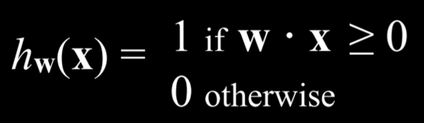
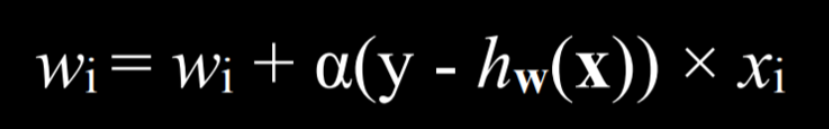
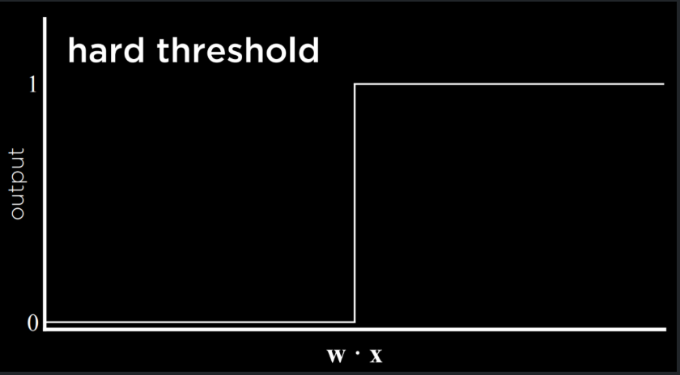
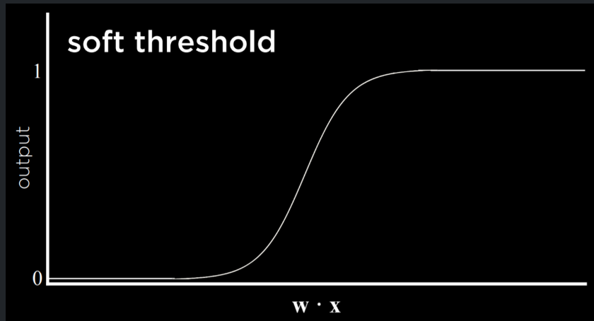
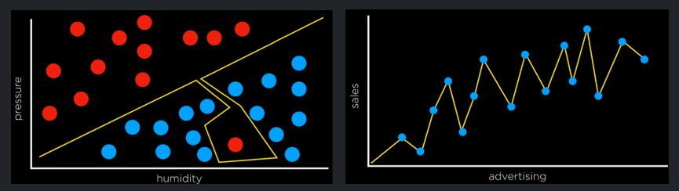
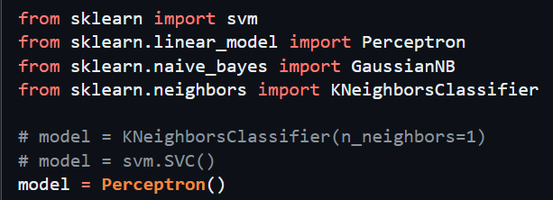

# Module 4: Learning

## a. MACHINE LEARNING

1. Process of providing computer with data (as opposed to explicit instruction) and allowing computer to recognise patterns within data to execute tasks independently

---

## b. SUPERVISED LEARNING

1. When a computer learns a function that maps an input (external data) to an (estimated) output based on a dataset or training set of input-output pairs

2. **CLASSIFICATION TASK** - problems that map inputs to DISCRETE output (i.e. given humidity/pressure input, predict if it will/won’t rain)

   1. **NEAREST NEIGHBOUR CLASSIFICATION** - method to solve a classification task where you map all data points in a training set and when presented a new datapoint, evaluate the state of KNOWN datapoints closest to the new one and assume the new one will have a similar output value

      1. NOTE: a problem with this is that if we consider only one neighbour, we risk inaccurate predictions from anomalies BUT if we consider ALL neighbours, task becomes intractable HENCE, we speed up process w certain methods

   2. **PERCEPTRON LEARNING** - an alternative method to solving classification tasks where we consider data as a WHOLE and attempt to find a BOUNDARY in the domain space to segregate the discrete outputs: when we are asked to predict a new datapoint, we simply map the datapoint in the domain space and we make our prediction on the output value based on which side of the boundary it falls on

      Boundary is called the HYPOTHESIS FUNCTION

      1. I.e. if we expect a linear boundary, the hypothesis func will be of the form:

         w₀ + w₁x₁ + w₂x₂ ≥ 0 ~ if input MEETS inequality, output is 1, otherwise, 0

         NOTE that each variable has a respective weight function and there is an additional w₀ to translate the line if necessary

      2. This can be rewritten in matrix form:

         

      3. AIM of algorithm is to find the BEST weight factors for the hypothesis func. that returns the most accurate predictions and so we need to be able to UPDATE these factors when presented with new information ~done via THE PERCEPTRON LEARNING RULE:

         

         (y - h(x)) = (ACTUAL VAL - ESTIMATED VAL) and so if the actual and est are equal, the weight stays the same, if we OVEREST, weight decreases etc.

         Alpha is the LEARNING COEFFICIENT (determines RATE of learning)

         ** not sure why we multiply by xᵢ

      4. Overall, this method results in a threshold function as seen on the LHS which says if a datapoint is on one side of our inequality, it MUST be 0 etc. - this is a HARD threshold

         BUT we are hardly ever this certain of our model’s accuracy and so we may want to employ a SOFT threshold which expresses a CONFIDENCE in our estimate or a probability in the outcome, as seen on the RHS

         **Executed using a LOGISTIC function

   3. **SUPPORT VECTOR MACHINES** - final method we look at to solve classification task where, like before we draw a boundary to separate the data but NOW we use an additional SUPPORT VECTOR to draw a boundary that allows for maximum LEEWAY for variation within the dataset by being as far as possible from BOTH groups (0,1)

      THIS boundary is called the MAXIMUM MARGIN SEPARATOR

3. **REGRESSION TASK:** also a supervised learning task but now mapping continuous inputs to a continuous output. Hence now, our hypothesis function does not aim to SEPARATE datapoints but PLOT a line/curve that PREDICTS the value of the output

---

## c. LOSS FUNCTIONS

1. Function quantifying how often a model incorrectly predicts the output of a test datapoint
2. I.e. for CLASSIFICATION PROBLEM, each point on the CORRECT side of hypothesis function has a value of 0 but a value of 1 if INCORRECTLY classified - tally total score for sum “loss”
3. I.e. for REGRESSION PROBLEM, each datapoint is a certain distance from the fitted curve/line and we can sum the modulus of the distances or the squares of distances to quantify loss

---

## d. OVERFITTING

1. A hypothesis function is overfitted to a model when it has very low loss on the dataset it was trained on but then very high loss when exposed to new datasets as it does not generalise well

   Examples of overfitting seen below:

   

2. **K-FOLD CROSS-VALIDATION** (test for overfitting): we divide our sum data into k sets - k-1 of those sets are used for TRAINING and 1 is used for TESTING. We repeat this but switch out the test set for one of the k-1 sets until ALL k sets have been used as the test set ONCE.

   Now have k evals of model: can average loss across them - see how well model generalises.

---

## e. REGULARIZATION

1. A “fix” of sorts to overfitting whereby complex hypotheses are PENALIZED and simpler more general ones are REWARDED to ensure we get a balanced best fitting/most general model
2. We can assign each hypothesis function a COST calculated by:

   cost(h) = loss(h) + λcomplexity(h) ~ we obviously aim to find a function with minimal cost

   Lambda is complexity penalty coefficient (determines how hard we punish a complex func)

---

## f. SCIKIT-LEARN

Scikitlearn library has modules for each hypothesis model we wish to implement

I.e. svm.SVC() is the SUPPORT VECTOR CLASSIFIER

I.e. KNeighborsClassifier(n_neighbors=1) is K NEAREST NEIGHBOUR CLASSIFIER

I.e Perceptron() is the PERCEPTRON LEARNING (by variable weights) CLASSIFIER

---

## g. REINFORCEMENT LEARNING

1. A different approach to machine learning whereby agent gets FEEDBACK for a given action in the form of a REWARD (i.e. a positive score) or PUNISHMENT (i.e. a negative score). We reward actions that lead to good outcomes and the agent aims to maximise its score, naturally resulting in the agent learning “good habits” (actions that frequently result in reward)

---

## h. MARKOV DECISION PROCESSES

1. We may frame a reinforcement learning task as a markov decision process by assigning:
   1. Set of states S ~ i.e. every tile coordinate in a game
   2. Set of actions Actions(S) ~ i.e. every direction possible to move in
   3. Transition model P(s’ | s, a) ~ i.e. probability agent actually makes it from tile s to s’
   4. Reward function R(s, a, s’) ~ i.e. how many points from making the s to s’ move

---

## i. Q-LEARNING

1. A model for reinforcement learning:
   1. Func Q(s,a) takes a state “s” and estimates the reward value from taking action “a”
   2. At the start of the problem, Q(s,a) = 0 for ALL states and ALL actions
   3. Then the agent starts TRYING various actions to gain knowledge:
      1. When it makes an action, agent finds out the value of that new state (Qnew) and must update its prediction function Q accordingly
      2. Q(s, a) ⟵ Q(s, a) + α(Qnew - Q(s, a)) is the general formula

         α is a “learning rate”, as before, but between 0 and 1 where α=1 results in the updated estimate being EQUAL to Qnew and α=0 means it remains same

      3. Qnew is NOT JUST the value/reward from getting to the new state as that is only one HALF of the picture: we must also take into account that new state’s proximity to high reward states
         1. Qnew = r + lambda x max(Q(s’, a’)) reflects both metrics:
         2. r is the reward from the immediate action and max(Q(s’, a’)) is the highest reward available from the resulting state, s’
         3. Lambda is simply a factor dictating how important future states are

   4. How to CHOOSE actions (heuristics) since we now know how to get Q values:
      1. OBVIOUS strategy is always pick action w the highest Q but this risks us getting stuck at local optima, not exploring actions that are not IMMEDIATELY better but better overall in sum reward
      2. **ε (EPSILON) GREEDY ALGORITHM**

         We set a value, ε as probability of EXPLORATION (i.e. we make a random move as opposed to the seemingly best move) making 1-ε the probability of EXPLOITATION (i.e. we make the move w highest Q)

      3. **END OF GAME FEEDBACK**

         We let agent play based on whatever heuristics we decide but reward feedback is only given at the end: only then will the agent evaluate which decisions were good/bad

      4. **FUNCTION APPROXIMATION**

         We describe states using “features” (i.e. in chess the features of a state may include king safety, x number of threatened pieces, how many/which pieces each side has etc.) and if actions result in similar states, the agent can recognize that the estimated values of those actions should be similar thus saving computation.

---

## j. UNSUPERVISED LEARNING

1. Tasks where we are not concerned with PREDICTING an output value but rather, are looking for patterns in the distribution of the datapoints
2. CLUSTERING is an UNSUPERVISED LEARNING TASK where we take input data and organise it into groups such that similar objects end up in the same group: successful if each item in a cluster is more similar to another item in the same cluster than any other item in another cluster

---

## k. K-MEANS CLUSTERING

1. Start by placing k random cluster centres around domain space
2. All datapoints nearest to that cluster centre, belong to that centre
3. Cluster centre then moves to centre of all the datapoints that belong to that cluster
4. (ii) and (iii) repeat until each point remains in the same cluster across iterations, meaning the cluster model has reached an EQUILIBRIUM

---

# SHOPPING PROJECT

## UNDERSTANDING

- **CSV INFORMATION:**
  - How many of each type of pages visited and duration spent on each type (first 6)
  - Next 3 columns contain Google analytics information
  - SpecialDay says how close the session date is to a “special day” (i.e. valentines)
  - Month is word abbrev of when user’s session was
  - Next 4 are info on the user themself
  - VisitorType tells us if they’ve visited before (Returning_Visitor if they have, other if not)
  - Weekend is True if session was on weekend, False otherwise
  - Revenue is True if customer made a purchase, False otherwise ~ what we aim to predict

- **SHOPPING.PY**
  - main() func splits csv into training and testing sets for us which we then must use to train a model to predict the value in the revenue column given all the other info
  - load_data() func:
    - Takes the csv data file name as input
    - Must read that csv and return evidence and labels
    - EVIDENCE is a LIST of all the evidence for each of the datapoints (INPUT DATA)
      - Should be a list of evidence lists where each evidence list contains the first 17 column values of a given row in the csv
    - LABELS should be list of labels for each data point (OUTPUT DATA)
      - Should be a list of the value in the REVENUE column for each row in the csv
  - train _model() func:
    - Takes list of evidence and labels from the TRAINING SET as input
    - Trains a KNeighborsClassifier (imported from sklearn) on that input
    - Returns the trained model as output
  - evaluate() func:
    - Takes list of labels from the TESTING SET and the model-trained PREDICTED vals
    - Compares the actual values to the predicted values and calculate two metrics:
      - SENSITIVITY: Proportion of POSITIVE labels accurately identified
      - SPECIFICITY: Proportion of NEGATIVE labels accurately identified

## PROJECT NOTES:

- IMPORT PROBLEMS: need python 3.12 for sklearn module BUT system keeps defaulting to 3.14 so to get around this, LITERALLY just need to:
  - A) Make sure the module gets installed to the 3.12 environment
  - B) Specify in command line which python version should be used:
    - `py -3.12 shopping.py shopping.csv`
- PREALLOCATION OF ITEMS IN A LIST:
  - `my_list = [None] * 17` ~ must be done like this

---

# NIM PROJECT

## UNDERSTANDING:

- Use Q-learning to teach model to play Nim
- STATE of game repped by list: `[pile0_num, pile2_num… etc.]`
- ACTION in game repped by tuple: `(pile_idx, num_obj_taken)`

## PROJECT NOTES:

- What are the `@classmethod` tags for?
- Why do some methods not pass `self` as arg but do pass `cls`
