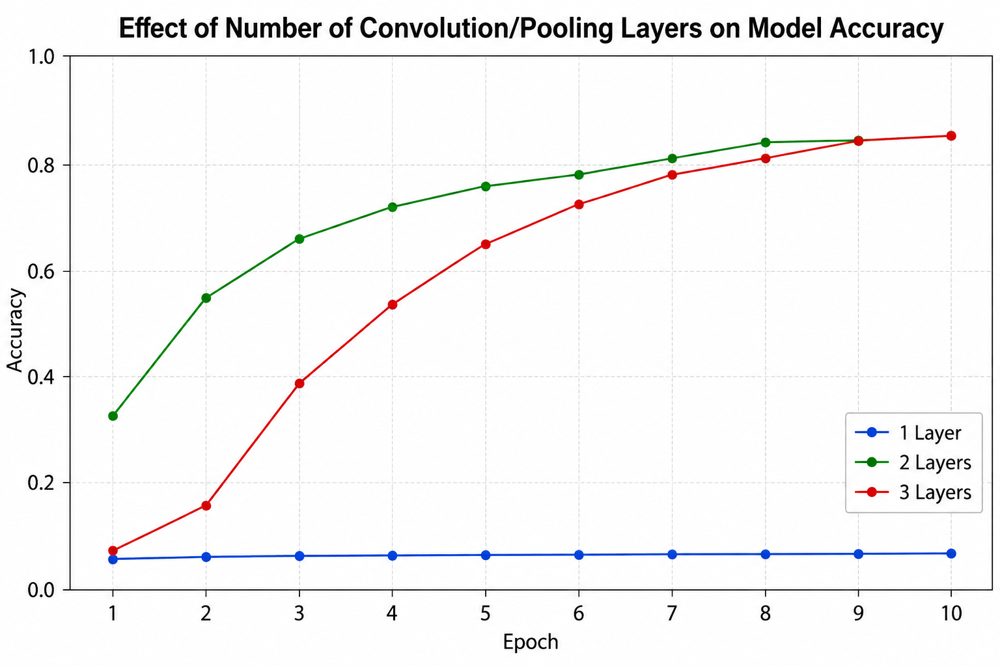
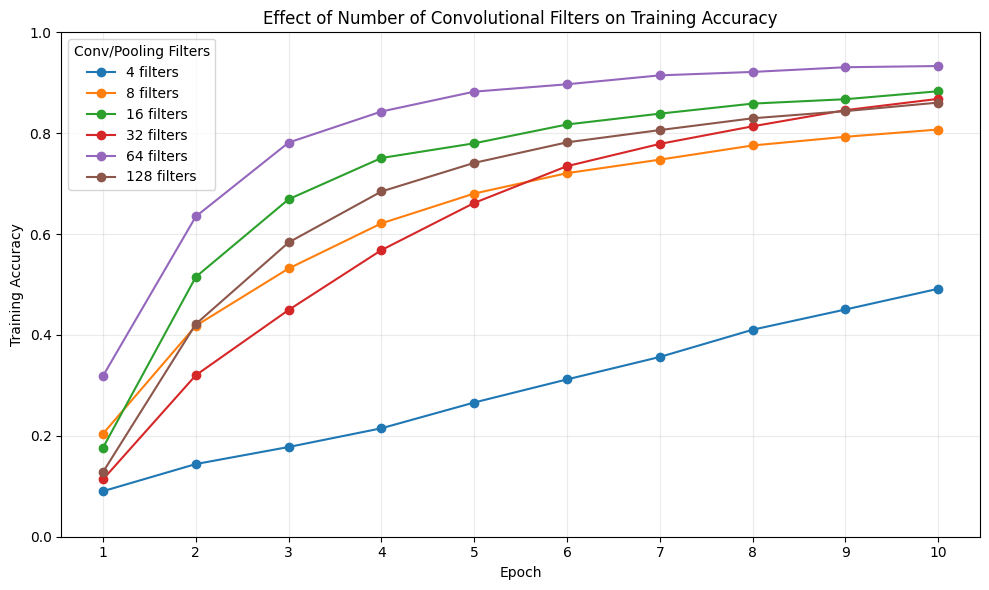
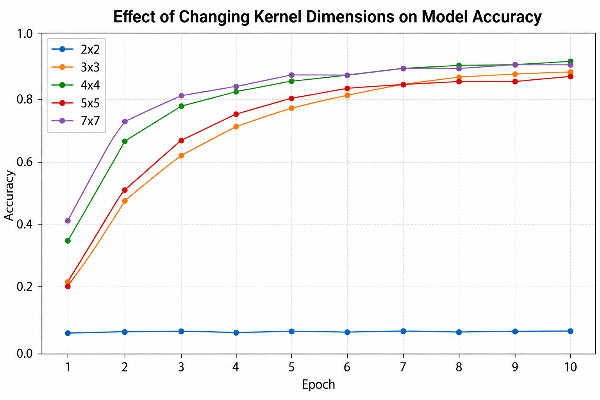
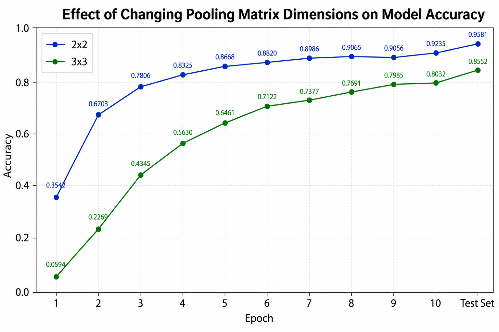
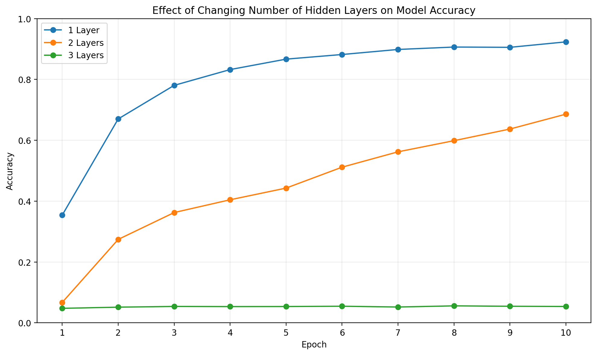
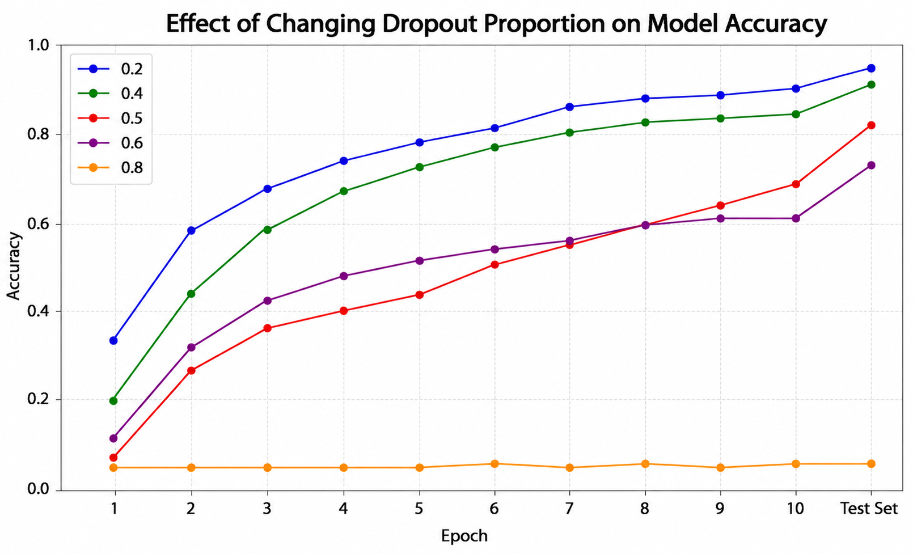
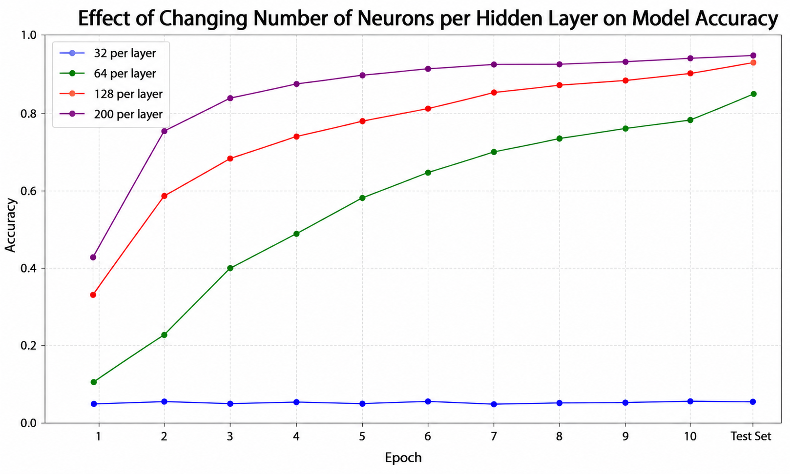

# Neural Network Parameter Study

## NOTES ON CONSTRUCTING MODEL:

### INPUT LAYER:

- `tf.keras.layers.Input(shape=(IMG_WIDTH, IMG_HEIGHT, 3))`
- Only to explicitly state what the each datapoint’s input should be in the form of

### CONVOLUTION LAYER:

- `tf.keras.layers.Conv2D(32, (3, 3), activation="relu", input_shape=(28, 28, 1))`
- 32 refers to 32 FILTERS: conv layers do NOT have neurons but their equivalent is a FILTER
- These filters accept an input that is (28x28 with 1 value for GREYSCALE INTENSITY)
- And each filter has a different associated (3x3) kernel matrix to perform this convolution ~ NOTE that the kernel weights in the kernel matrix are updated on each batch, optimising to distill out the most important/useful features from the input to minimise loss
- Hence we needn’t specify each of the 32 kernels beforehand
- ReLU Activation function is used at EVERY point of the kernel convolution:
  - We apply kernel matrix to an area, sum the resulting values + bias to get output
  - This output then gets passed through the activation function
  - Hence if output is less than 0, output is simply 0 ~ in any other case, it’s unchanged
- REMEMBER ~ ReLU is introducing NON-LINEARITY to help us model non-linearity

### MAX POOLING LAYER:

- `tf.keras.layers.MaxPooling2D(pool_size=(2, 2))`
- Takes post-convoluted image and reduces input, taking max value of a 2x2 filter across image

### FLATTEN LAYER:

- `tf.keras.layers.Flatten()`
- Signals the end of convolution/pooling phase
- Turns the matrix representing the images (needed as input for convolution/pooling) into single values (needed as input for hidden dense layers)
- NOTE that this layer has no associated weights, activation functions or anything like that ~ hence why Flatten() has no arguments: it simply turns the matrices into single values

### HIDDEN DENSE LAYER:

```python
tf.keras.layers.Dense(128, activation="relu")
tf.keras.layers.Dropout(0.5)
```

- Dense layer needed to learn the patterns to separate datapoints based on their outputs
- NOTE: more than one layer needed to better model non-linear patterns
- Dropout used to improve generalisation for test set (reduces neuron over-dependence)

### OUTPUT LAYER:

- `tf.keras.layers.Dense(NUM_CATEGORIES, activation="softmax")`
- NOTE that keras does not have an explicit class for an OUTPUT layer so we just use Dense
- Only need to specify how many outputs we expect (we have 43 bins in this case so 43 outputs) ~ we used 43 labels in the training set and want to class signs into 43 categories so we use 43
- And the activation function for each bin ~ softmax usually best for output layer as it’s prob dist
- NOTE: I am not sure how the output for this works, exactly or even how softmax works for this since the bins are discrete and not continuous ~ might be worth trying step function, see what happens
- ANSWER: Model expects 43 outputs (from the output layer) and so whenever it sees a new label from the training set, it assigns one of the outputs to that label
  - Then in training, given certain features, the model learns to assign certain relative probabilities to each potential label
  - The softmax activation function results in a probability distribution across these labels
  - Then in evaluation (test phase), the highest probability label is compared to true value
- HENCE, is NOT worth trying the step function - may result in multiple 1s (inaccurate)

---

## HISTORY OF MODEL STRUCTURE:

### Model 0:

- INPUT LAYER

```python
tf.keras.layers.Dense(1, input_shape=(IMG_WIDTH, IMG_HEIGHT, 3), activation="relu")
```

- CONV LAYER

```python
tf.keras.layers.Conv2D(32, (3, 3), activation="relu", input_shape=(WIDTH, IMG_HEIGHT, 3))
```

- MAX POOL LAYER

```python
tf.keras.layers.MaxPooling2D(pool_size=(2, 2))
```

- FLATTEN LAYER

```python
tf.keras.layers.Flatten()
```

- HIDDEN LAYER W DROPOUT

```python
tf.keras.layers.Dense(128, activation="relu"),
tf.keras.layers.Dropout(0.5)
```

- OUTPUT LAYER

```python
tf.keras.layers.Dense(NUM_CATEGORIES, activation="softmax")
```

### Model 1:

- INPUT LAYER REMOVED

### Model 2:

- INPUT LAYER REINTRODUCED:

```python
tf.keras.layers.Input(shape=(IMG_WIDTH, IMG_HEIGHT, 3))
```

---

## THINGS TO TRY:

- Add more conv/pool stages before flattening
- Add more hidden layers to better model non-linear patterns
- Mess around with output to see if problem lies there

---

## MISC NOTES:

- Made mistake of doing everything on cloud which was not issue until now
- There WERE problems with git actually - figure out later
- BUT main issue was fetching the info from cloud every time when executing load_data()
- Now takes VERY LONG, bottlenecking the whole process
- Also made mistake of using command: `py -3.12 file.py model.h5` when INSTEAD we NEED to replace the model name with `[model.h5]` otherwise model does not

---

## FINDINGS:

- Effect of adding more convolution/pooling layer:
  - One was too few: learning didnt improve accuracy beyond 5%
  - Two was excellent: best accuracy and fastest learning
  - Three was too many? Slightly lower accuracy than before: maybe model was too complicated with not enough data to learn on to optimise well enough to beat two conv/pool layers

---

## STUDY OF EFFECT OF NUM OF CONV/POOLING LAYERS

```python
tf.keras.layers.Conv2D(32, (3, 3), activation="relu",
input_shape=(IMG_WIDTH, IMG_HEIGHT, 3)),
tf.keras.layers.MaxPooling2D(pool_size=(2, 2)),
```



NOTE: after study, number of layers was fixed at 2

---

## STUDY OF CHANGING FILTERS NUM IN CONV/POOLING LAYERS



NOTE that increasing filter nums increased comp time

NOTE: after study, number of filters fixed at 64

*Figure out what the trend is, how much is down to variation with each training of model and figure out why sometimes, training just flops entirely

---

## STUDY OF CHANGING CONVOLUTION KERNEL DIMENSIONS



NOTE that increasing kernel dimensions generally increased computation time ? But not by a significant amount each time

May need to ask gpt what expected trend is

Note that 10 by 10 was not allowed because too big??

---

## STUDY OF CHANGING POOLING MATRIX DIMENSIONS



NOTE: 4x4 too big and 3x3 worse than 2x2 so we stick with 2x2

---

## STUDY OF CHANGING NUMBER OF HIDDEN LAYERS

```python
tf.keras.layers.Dense(128, activation="relu"),
tf.keras.layers.Dropout(0.5)
```



---

## STUDY OF CHANGING DROPOUT IN EACH HIDDEN LAYER

*NOTE we have kept two hidden layers for these studies



Neuron count was kept constant at 128 for this test

And dropout proportion changed to 0.2 after this

---

## STUDY OF CHANGING NUMBER OF NEURONS PER HIDDEN LAYER

*NOTE we have kept two hidden layers for these studies



---

## Overall observations

- Changing hidden layer stuff did not matter until conv/pool layers were sorted but once they wre, sorting hidden layers enabled us to increase rate of learning
- What is the effect of putting dropout after both hidden layers
- What is the effect of having differing number of neurons in adjacent hidden layers
- It seems that removing one of the dropouts helped AND/OR staggering neuron count 250 then 200 resulted in a consistently good accuracy
