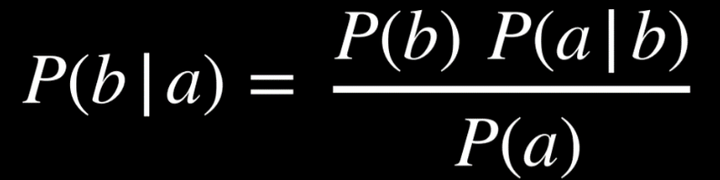
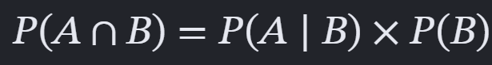
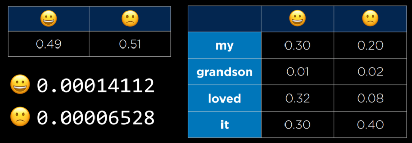

# Module 6: Language

## a) INTRO

1. **NATURAL LANGUAGE PROCESSING TASKS:** any tasks where AI receives human language as input to be processed in some form ~ examples include:
   - Auto-summary; info extraction; lang identification/translation; explanation; speech recognition

---

## b) SYNTAX/SEMANTICS

1. **SYNTAX:** sentence structure
   - Need to be able to form sentences w correct syntax, understand meaning from syntax and navigate ambiguity in meaning despite correct syntax + grammar

2. **SEMANTICS:** sentence/word meaning
   - Need to be able to ascribe meaning to a individual words, navigate changes in meaning based on context and ambiguity in meaning commonly seen in natural language

---

## c) CONTEXT-FREE GRAMMAR

1. **FORMAL GRAMMAR:** the system of rules for generating correct sentences in a language

2. **CONTEXT-FREE GRAMMAR:** ignoring meaning of sentence to focus on representing its structure using FORMAL GRAMMAR
   1. We first classify individual words into categories (i.e. N(noun),V(verb),D(def article)
   2. Then we can classify PHRASES based on FORMAL GRAMMAR RULES
      1. I.e. Let’s classify “she saw the city”
      2. City = N, the = D ~RULE says we can make a NOUN PHRASE (NP) from D followed by N hence we let “the city” be represented by NP
      3. Saw = V ~ RULE says we can similarly make a VERB PHRASE from V followed by NP hence we represent “saw the city” with VP
      4. Finally, N followed by VP rule allows us to represent “she saw the city” w NP

---

## d) NLTK

1. A python library that allows us to implement the above idea

2. How to use ntlk library to create a parser:

   1. First import the toolkit:

      ```python
      import nltk
      ```

   2. Next, set out the RULES, outlining which combinations of word types are allowed

      ```python
      grammar = nltk.CFG.fromstring("""
      S -> NP VP
      NP -> D N | N
      VP -> V | V NP
      D -> "the" | "a"
      N -> "she" | "city" | "car"
      V -> "saw" | "walked" """)
      ```

      - First defines sentence as noun phrase followed by verb phrase
      - Defined noun/verb phrases
      - NP either a noun or def article w noun, VP as verb or verb + noun phrase
      - NOTE: “|” means OR here
      - Categorises our total wordset into the most basic classes (non-phrase)

   3. Finally, create a parser bassed off the outlined rules:

      ```python
      parser = nltk.ChartParser(grammar)
      ```

3. How to use a parser (+ its rules) to classify sentence into diff arrangements of phrases

   1. Split input sentence into a list of each individual word in sentence

      ```python
      sentence = input("Sentence: ").split()
      ```

   2. Try to to use parse.parse(sentence) method to get a list of ALL possible classification trees possible for that sentence

      ```python
      try:
          for tree in parser.parse(sentence):
              tree.pretty_print()
              tree.draw()
      ```

   3. If no trees can be formed, print a corresponding message:

      ```python
      except ValueError:
          print("No parse tree possible.")
      ```

---

# SYNTAX

## e) N-GRAMS

1. We break up natural language into consective groups of n to create n-grams
   1. NOTE we can have WORD n-grams (groups of n words) or even CHARACTER n-grams (groups of n letters)

2. This is useful because by doing this on a large dataset, a model can learn a probability distribution as to which word statistically ought to follow another as some n-grams will appear much more often than others

---

## f) TOKENIZATION

1. Related to above, this is the PROCESS of splitting sequence of characters into groups (tokens)
2. So we essentially use tokenization to CREATE n-grams
3. There are imperfection/challenges to this method of forming tokens/n-grams though:
   - Dealing with punctuation: do we remove punctuation (words like o clock special case)
   - Also punctuation is important to sentence structure so this method throws info away
   - Also need a way to distinguish between period in Mr. and period to end sentence
4. Dealing with all of these problems is the process of tokenization

---

## g) MARKOV MODELS

1. Applies tokenization/forming n-grams to forming probability distribution/transition models that take us from current word to next word based off all previous words

2. Recall a transition model is a probability model that takes us from one state to the next adjacent state, based on a FINITE number of previous states]
   1. Applied to this case, if we have probability density for TRI-grams, if we know the first two letters, we can pick the most likely third letter by finding the most probable tri-gram containing those first two words

3. See generator.py for an example implementation of this

---

# SEMANTICS

## h) BAG-OF WORDS MODEL

1. A model that approaches each sentence as un unordered collection of words (ignores syntax)
2. Useful model as it ONLY considers MEANING of the words - good for sentiment analysis which involves trying to find the underlying feeling/sentiment behind a sentence (classifying reviews)

---

## i) NAIVE BAYES

1. Technique used to calculate probability of form: P(sentiment | sentence)

2. Let’s apply to example statement: “My grandson loved it”

   1. We want P(Pos | “My grandson loved it”) and so first thing we can do is apply Bayes’ Theorem below to flip the conditioning to P(“My grandson loved it” | Pos)

      NOTE that we will normalise probabilities at the end, allowing us to write:

      P(Pos | “My grandson loved it”) α P(“My grandson loved it” | Pos) * P(Pos)

      

   2. Now we use conditional/joint probability rule to write the conditional prob as a joint one

      Once again, since we will be normalising, P(B) gets treats as a const, resulting in:

      P(“My grandson loved it” | Pos) α P(“My grandson loved it” , Pos)

      OVERALL: P(Pos | “My grandson loved it”) α P(“My grandson loved it” , Pos) * P(Pos)

   3. NOW WE USE NAIVE BAYES FOR FINAL SIMPLIFICATION:
      - P(“My grandson loved it” , Pos) is still a monster to compute because not only is each word dependent on P(Pos) but they are ALSO dependent on EACH OTHER’s probs
      - NAIVE BAYES assumes words are independent of each other (a large simplification that still works to give decent results) so words only conditional on P(Pos)
      - P(“My grandson loved it”,Pos)=P(“My”|Pos)*P(“grandson”|Pos)*P(“loved”|Pos)*...

      

   4. We now have a way to calc the cond prob for measurable probabilities:
      - P(Pos|“My grandson loved it”) α P(Pos)*P(“My”|Pos)*P(“grandson”|Pos)* …
      - We ought to have a dataset specifying which reviews are positive and which are negative allowing us to count frequencies to get the data below:

      

      - This table allows us to calculate all probabilities on RHS of equation
      - When we calculate P(pos|sentiment) and P(neg|sentiment) recall that we calculate PROPORIONAL VALUES that need to be normalised: most of the time, reviews are positive or negative hence we can do
      - P(pos|sentiment) + P(neg|sentiment) = 1 and normalise the two probabilities with this fact
      - We are simplifying finding the relative probabilities across those conditional values

### ADDITIVE SMOOTHING

- NOTE: a potential problem could come from our sample not containing a certain word ~ this method that relies on counting word frequencies in pos/neg reviews would result in P(word|pos)=P(word|neg)=0
- This obviously does not reflect and so additive smoothing adds a certain α value to each frequency which smooths the data and prevents scenarios like this from happening
- Laplace Smoothing is common - involves adding 1 to each frequency

---

## j) WORD REPRESENTATION

1. We need a way to easily represent words to a computer

2. **ONE-HOT REPRESENTATION:**
   1. Similar to what we did in neural networks where we knew our training set inputs were mapped to 43 bins of output and so we created a list of 43 binary variables, 1 per bin
   2. If a label/output was the same as represented by the 2nd bin, the 2nd variable would be 1 on the list and all the others would be 0
   3. This means if we are selecting/representing a word from a dictionary of 50000 words, EVERY word of those 50000 must be represented by a list of length 50000
      1. Dreadful for memory/computation etc.

3. **DISTRIBUTED REPRESENTATION**
   1. Instead of using BINARY variables, we say each variable in the list is continuous (can be any real number) and the combination of those variables represents a point in a “word vector space” that corresponds to that word’s meaning relative to other words
   2. This is not only reduces the length of the lists needed to represent the same words but also creates a vectorspace allowing us to infer meaning from position

---

## k) WORD2VEC

1. The ALGORITHM used for generating DISTRIBUTED REPRESENTATIONS of words (above)

2. Algorithm uses SKIP-GRAM ARCHITECTURE (neural network for predicting context g:
   1. Model receives a WHOLE VOCABULARY LIST (i.e. “The cow grazes on pastures”) and a target word within that vocab list (i.e “cow”) to determine the “context of”
   2. This works by passing target word as input in INPUT LAYER- commonly via one-hot representation relative to vocab list - i.e. “cow” would be [0,1,0,0,0]
      1. NOTE: number of neurons = number of words in vocab list
   3. This one-hot representation then gets passed through a DENSE HIDDEN LAYER which “embeds” the target word meaning it gets assigned a vector representation
      1. NOTE: the number of neurons used in this layer will be same as the length of the vector - 3 neurons means [x,y,z] vector hence more neurons means more “resolution” in the definition/position of the word in the vector space?
   4. This finally gets passed to DENSE OUTPUT LAYER with same number as neurons as there are words in the vocab list, just like the input layer
      1. Each neuron is associated with a word from vocab list and P(assoc_word | target _word) is calculated to find words that are most likely to appear near the target word (i.e. its CONTEXT)
   5. This model gets trained by feeding it with actual scripts/literature and it can empirically calculate these probabilities with frequency of words appearing around other words

3. By the end, AI has created a vector space where we can add/subtract vectors to find equivalents of certain words, given context

---

## l) NEURAL NETWORKS

1. FEED-FORWARD NETWORKS seen above used in turning word into vector representation - works for a standard 1 t o1 mapping of a single word

2. As discussed in prev chapter, this does not work for translation tasks - passing whole sentences as input and making model learn its specific translation output is very inefficient
   1. Require ALOT of brute-force learning ~ instead, can translate sentence piece-wise - one word at time while providing context of what’s already been translated
   2. Can’t be done with feedforward model: requires RECURSIVE NEURAL NETWORK

3. How does the process work?

   1. **ENCODING STAGE**
      1. First word is EMBEDDED to vector representation of the word with RNN

         Word w0 is input, embedded version h0 (hidden state) is output

         NOTE: h0 is the START of the whole sentence in embedded form

      2. RNN then gets fed the next word in sentence w1 as input ALONG with h0 (context of what came before) to also embed w1 into embedded sentence

      3. Result is h1 - an embedded sentence with the embedded words, w0 and w1

      4. Process continues until we reach wn in sentence with n words to make hn

         hn contains the COMPLETE embedded sentence

   2. **DECODING STAGE**
      1. Whole sentence in embedded vector format gets passed as input to decoder
      2. The decoder then starts translating the sentence, knowing all of hn
         1. NOTE: the knowing the whole sentence bit is crucial because in many languages, sentences are constructed in different orders (different syntaxes) meaning 1 to 1 translations in order are rare
         2. But the fact the model already knows the whole sentence means it can construct the translated sentence with this in mind
            1. The model can’t go back and change structure of translated sentence if it has been constructed wrong
         3. It’ll construct this sentence in stages of hidden states: each hidden state appends one word to translated sentence

4. **PROBLEM WITH THIS STRATEGY:**

   1. Encoding stage output (hn) is a hidden state containing ALL words from sentence in embedded vector format (it essentially contains ALL hidden stated before it)

      For long sentences, this can be ALOTT of info to store in just ONE value resulting in INFORMATION BOTTLENECK (limit to how much info can be retained in one hidden state value)

      1. Ideally, we would combine all these hidden states to retain all info

   2. ALSO, some hidden states are more important (i.e. carry more info) than other hidden states in (i.e. filler words between the key info)
      1. Ideally, we would identify these more important states and prioritise them

---

## m) ATTENTION

1. ATTENTION is used to decide what values are more important at which points in time

   (The solution to BOTH previous issues of info bottleneck and no importance priority)

2. How attention works ~ in context of TRANSLATION:

   1. Just as before, we create a hidden state for each word in the sentence - each hidden state is a vector representation of the word plus the context of what came before it
      1. This is the same encoding stage as before

   2. But, during each decoding stage, we now consider attention before each translation
      1. When translating first word, we consider all hidden states and assign each one a relative importance (that sums to 1) which is essentially how likely each non-translated state is to be the first word in the translated sentence
      2. Attention is calculated probabilistically based on everything we already know

         I.e. When translating “A white house”, when evaluating the first word of the translation, “A” will have a high attention value as it often appears first

         Similarly, for the second word, “white” and “house” may have high attentions as both are likely to follow “A”

   3. This enables us calculate the CONTEXT VECTOR which is each hidden state’s vector (info on word meaning + context up until that point) multiplied by its attention, summed

   4. This context vector is what now gets passed to decoding stage (as opposed to hidden state hn) since it now contains all other states WEIGHTED by their importance as well as ALL other hidden states instead of just one
      1. Thus solved info bottleneck AND no importance priority issues

   5. From this vector, the model produces a probability distribution over its corresponding French vocabulary and chooses most likely word from that distribution: 1st word found

   6. NOTE: we then move onto the next word ~ hidden state vectors from encoding stage do NOT change (as words + order haven’t changed) BUT the attention values WILL
      1. Now that we are looking at the SECOND word, the words we must pay attention to have likely changed and so we recalculate attention and repeat

3. FINAL issue with this model ~ Lack of parallelism
   1. Recall that in the encoding stage, we are required to process each hidden state sequentially as we cannot find the vector of a hidden state without the input of the hidden state before it
   2. This required sequential training ends up taking alot of time for large models
   3. Hence ideally, we would move towards a model that utilises parallelism

---

## n) TRANSFORMERS

1. A NEW type of training architecture where each word is passed through neural network simultaneously (as opposed to sequentially)

2. How does encoder work?
   1. Since we are no longer doing in sequence, WORD ORDER can be lost easily and so we add POSITION ENCODING to the inputs to not lose that important information

   2. ALSO we add SELF-ATTENTION step(s) to help define context of word being inputted
      1. This is where we allow each word (“i.e. “dog”) in the input sentence to decide which OTHER words in the sentence are relevant to describing the context behind “dog”. For instance, “terrier” may have high self-attention for dog
      2. NOTE: self attention is SO useful that models often use MULTIPLE different self-attention layers to pay attention to different facets of the input
         1. Known as MULTI-HEADED ATTENTION

   3. The third and final step is the actual neural network which takes those inputs and produces an encoded representation output
      1. NOTE: the self-attention + neural network step can be repeated many times to get a much deeper representation of each word in input

   4. This process is done in parallel for every word in sentence and result are encoded representations of each word that contain both info on word position AND context

3. How does decoder work?
   1. On the surface, VERY similar to the encoder, just with slightly different inputs
   2. Decoder takes the PREVIOUS output word as input and performs POSITIONAL ENCODING, SELF-ATTENTION, ATTENTION, NEURAL NETWORK PROCESSING and then chooses an output word
      1. The first difference is how the PREV output word is the input but we similarly use its position and context to choose the next word
      2. Second difference is in the ATTENTION step which takes input of the ENCODED REPRESENTATIONS of the input words from the encoding step and assigns an attention to each of those
         1. Hence output is also chosen based on importance of input words

---

# PARSER PROJECT

- Edit NON-TERMINALS, adding rules to enable us to parse through all text files
- Write preprocess func to turn input sentences into simple list of words
- Write np_chunk func to return a list of the most simple noun phrases in each tree

## NOTES:

- Use uppercase variable names to indicate a CONSTANT (values doesnt change when we run script)

---

# ATTENTION PROJECT

## TASK:

- FIRST: Use transformers library to write program that uses BERT to predict masked words
  - BERT is a transformer-based language model developed by Google
  - It was built to predict a masked word from context of surrounding words
  - In the base BERT model: 12 layers, each with 12 self-attention heads

- SECOND: Analyse diagrams generated by our program to understand WHAT BERT’s attention heads are paying attention to

## UNDERSTANDING:

### main() function:

#### TOKENIZER:

```python
MODEL = "bert-base-uncased"
tokenizer = AutoTokenizer.from_pretrained(MODEL)
inputs = tokenizer(text, return_tensors="tf")
```

- AutoTokenizer line loads the tokenizer belonging to the MODEL passed as argument~recall the tokenizer is what converts the raw text to numerical tokens that the neural network can process
- tokenizer(text) line takes a raw text input and converts it into tokens
  - HOW it breaks words up was dictated by previous line: whichever tokenizer selected
  - INPUT is a simple sentence string
  - OUTPUT is a list of IDs (by default), each corresponding to a word
  - BUT with return_tensors="tf", OUTPUT is REFORMATTED as TensorFlow tensors
    - Hence, the variable called “inputs” is now formatted as a DICTIONARY with:
      - `"input_ids": <tf.Tensor ...>`, i.e. `[[101, 1045, 2066, 8870, 102]]`
      - `"attention_mask": <tf.Tensor ...>` i.e. `[[1, 1, 1, 1, 1]]`

#### PROCESS INPUT:

```python
# Use model to process input
model = TFBertForMaskedLM.from_pretrained(MODEL)
result = model(**inputs, output_attentions=True)
```

- First line loads a model based on the specified MODEL arg ~ in this case, "bert-base-uncased"
  - NOTE: model is PRETRAINED so we can get right into prediction
- Second line uses that model, passing our input tokens as arg to predict what [MASK] token is
  - RECALL that **inputs means we UNPACK inputs before we pass it as input
  - Also recall that inputs is a DICTIONARY + when we unpack dictionary in input, the KEY values become NAME of the KEYWORD ARGUMENT that its corresponding value gets assigned to
  - Hence, `model(inputs_id = inputs[“inputs_id”], attention_mask = inputs[“attention_mask”], …)`
  - ALSO output_attentions = True is simply asking model to also output the SELF-ATTENTION weights it calculated when making the resulting prediction
- result is a variable containing SEVERAL outputs of the model but most important are:
  - result.logits contains the SCORES/REL. PROBS. of every word in vocabulary appearing in a given slot in the input sentence ~ NOTE: scores can be turned into prob dist, using softmax
    - I.e. for input sentence: “The cat sat on the [MASK]”:
    - result.logits.shape returns `(input_sent=1, input_tokens=7, words_in_vocab=30000)`
    - result.logits[i, j] returns logits list predicting word in position j in sentence, for layer i
  - result.attentions[i] returns 2D-list representing attention grid numerically for layer i

#### GENERATE PREDICTIONS:

```python
mask_token_logits = result.logits[0, mask_token_index]
top_tokens = tf.math.top_k(mask_token_logits, K).indices.numpy()
```

- result.logits[0, mask_token_index] returns logits list for the mask_token in layer 0
  - I.e. In layer 0, returns list of words with highest probability of replacing mask token
- Second line returns only the top K most likely words (top K largest logits)
- tf.math.top_k(...) returns a TENSORFLOW obj with:
  - TOP K words’ indices in the vocab list (accessed with .indices)
  - TOP K words’ LOGIT values for each of those words (.values)
- Finally, .numpy() reformat the TensorFlow obj as a NumPy array
- Hence this line, returns top_tokens which is simply a list of the indices of the vocab list that corresponds with the most likely words to go into the mask_token slot

#### VISUALISE ATTENTIONS:

- `visualize_attentions(inputs.tokens(), result.attentions)`
- Takes input tokens as input as well as list of ALL self-attentions calculated across ALL layers
- Outputs visualisation of ALL 144 attention grids from 12 layers with 12 self attention heads

### KEY INFO:

- Format of result.attentions: `[layer_idx][batch_idx][head_idx][token1_idx][token2_idx]`
  - Layer: which layer of neural network we are concerned with
  - Batch: which input sentence we are concerned with
  - Head: which attention head we are concerned with
  - Token1/2: How much attention token1 pays to token2 when calculating the new representation of token1 (recall representation is the vector containing info on meaning/context of a token)

** NOTE: no reason as to why layer > batch > head (tho batch > layer > head seems better)

---

## MISC NOTES:

- NumPy array
  - Called by `a = np.array([1, 2, 3, 4, 5, 6])`
  - Similar to lists in how we index ~ i.e. `a[0]` BUT can index nested values with a list ~ i.e. `a[0,1]`
  - When we print array, will print out `array({list_format_of_array})`
  - `.shape`, `.ndim`, `.size` all give info on structure of the array
  - NOTE: ALL items in array MUST be same datatype which can be accessed with `.dtype`
  - Arrays are also VERY useful for mathematical operation (i.e. no need for list comprehension)
  - Can imply use maths operations on 2 arrays and it intuitively calculates resulting array
